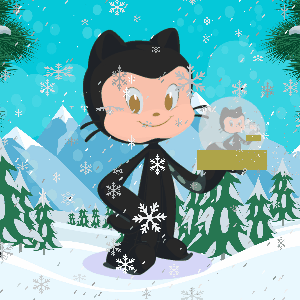

<h3 align="center">👋 Hi there, nice to meet you. I'm Lenar Gasimov. Welcome to my GitHub!</h3>

	<h2>🚀 Some Tools I Use</h2>
	
	
	
	
	
	
	
	
	
	
<!-- 	 -->

	<h2>🎧 Spotify Playing</h2>
	   

	<h2>🐦 Latest Tweets</h2>
	

	

	
<i>Hope you enjoy the Christmas eve with the ones you love and step into the new year with lots of happiness and good health. Wishing you a merry Christmas and a very happy new year!  
		 
		Warmest wishes,  
		Lenar Gasimov.</i>

	

	<h2>📮 Reach me on</h2>
	
	
	</a>
	

